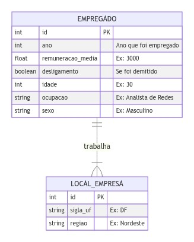
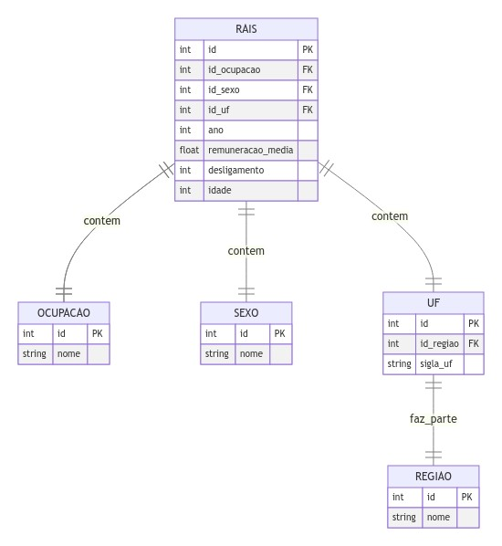

<!-- https://marpit.marp.app/ -->
<!-- https://marpit-api.marp.app/ -->

## Título: Impacto da COVID-19 na diferença salarial e demissões entre homens e mulheres da área de tecnologia da informação

## Alunos:

- Marcelo Anselmo de Souza Filho
- Arivaldo Gonçalves de Freitas Junior
- Luciana Maria de Araujo Freitas

---

# 1. Introdução

**Sobre**: Este estudo aborda a diferença salarial entre homens e mulheres na área de TI durante a pandemia. Ele também explora possíveis cenários para analisar a disparidade salarial e de desligamento entre gêneros na área de tecnologia, antes e após a pandemia. Utilizou-se dados a nível do indivíduo, de 2018 e 2019 (antes da pandamiea) e de 2020 e 2021 (durante a pandemia), obtidos da Relação Anual de Informações Sociais (Rais), que proporciona dados oficiais sobre o mercado de trabalho no Brasil.

---

# 1. Introdução

**Resultados**: No geral, ficou evidente que, no período analisado, a quantidade de homens na TI é muito maior do que a de mulheres. Constatou-se que a remuneração média das mulheres é maior que a dos homens apenas na região nordeste. Além disso, a quantidade de desligamento de homens e mulheres é maior em 2021 (691.982) e a menor é de 2019 (162.073).

---

# 1. Introdução

**Tecnologias utilizadas**:

- BD: Mysql (docker)
- Linguagem: Python
- Dados: RAIS
- Ambiente de DEV: VsCode + Jupyter Notebook

---

# 2. Modelo de dados Relacional

## Modelo Conceitual



---

# 2. Modelo de dados Relacional

## Modelo Lógico

Normalizado até a 3º forma normal.



---

# 3. O script SQL que gerou o banco de dados.

```sql
-- ============= CRIANDO DB =========================

DROP DATABASE IF EXISTS projfbd;
CREATE DATABASE projfbd DEFAULT CHARACTER SET 'utf8';
USE projfbd;
```

---

# 3. O script SQL que gerou o banco de dados.

<!--
_class: diminuir-sql
-->

```sql
-- ============= CRIANDO AS TABELAS =========================

CREATE TABLE
    OCUPACAO (
        id INT NOT NULL,
        nome VARCHAR(255) NOT NULL,
        PRIMARY KEY (id)
    ) ENGINE = InnoDB;

CREATE TABLE
    SEXO (
        id INT NOT NULL,
        nome VARCHAR(9) NOT NULL,
        PRIMARY KEY (id)
    ) ENGINE = InnoDB;

CREATE TABLE
    REGIAO (
        id INT NOT NULL,
        nome VARCHAR(12) NOT NULL,
        PRIMARY KEY (id)
    ) ENGINE = InnoDB;

CREATE TABLE
    UF (
        id INT NOT NULL,
        id_regiao INT NOT NULL,
        nome VARCHAR(2) NOT NULL,
        PRIMARY KEY (id),
        FOREIGN KEY (id_regiao) REFERENCES REGIAO(id)
    ) ENGINE = InnoDB;

```

---

# 3. O script SQL que gerou o banco de dados.

```sql
CREATE TABLE
    EMPREGADO (
        id INT NOT NULL AUTO_INCREMENT,
        id_ocupacao INT NOT NULL,
        id_sexo INT NOT NULL,
        id_uf INT NOT NULL,
        ano INT NOT NULL,
        remuneracao_media FLOAT,
        desligamento INT,
        idade INT NOT NULL,
        PRIMARY KEY (id),
        FOREIGN KEY (id_ocupacao) REFERENCES OCUPACAO(id),
        FOREIGN KEY (id_sexo) REFERENCES SEXO(id),
        FOREIGN KEY (id_uf) REFERENCES UF(id)
    ) ENGINE = InnoDB;

```

---

# 4. Processo de ETL (Extract, Transform, Load)

## Extração

Após filtrar os dados da tabela Relação Anual de Informações Sociais ([RAIS](https://basedosdados.org/dataset/3e7c4d58-96ba-448e-b053-d385a829ef00?table=c3a5121e-f00d-41ff-b46f-bd26be8d4af3)) pelos anos de 2018 a 2021, foi feito o filtro pelos IDs de cargos de Tecnologia da informação conforme a Classificação Brasileira de Ocupações ([CBO](https://cbo.mte.gov.br/cbosite/pages/home.jsf)).

- 212205: Engenheiro de Aplicativos em Computacao
- 212210: Engenheiro de Equipamentos em Computacao
  ...etc

---

# 4. Processo de ETL (Extract, Transform, Load)

## Extração

1. Em seguida, obtivemos os dados dos profissionais de TI no Brasil entre os anos de 2018 a 2019

- Quantidade **total**: 1.543.009
- Quantidade **por ano**:
  - 2021: 691.982
  - 2018: 466.852
  - 2020: 222.102
  - 2019: 162.073

---

# 4. Processo de ETL (Extract, Transform, Load)

## Transformação

1.  Primeiro, juntamos os dados com a planilha de Sexo

        1,Masculino
        2,Feminino
        -1,Ignorado

1.  Em seguida, juntamos os dados com a planilha com o nome dos Cargos

        212205,Engenheiro de Aplicativos em Computacao
        212210,Engenheiro de Equipamentos em Computacao
        ...

---

# 4. Processo de ETL (Extract, Transform, Load)

## Transformação

1. Logo após, selecionamos apenas a colunas necessárias e as renomeamos

1. Por fim, alteramos todos os dados com "idade" = 0 para o mínimo de 14 anos (que é o menor valor, retirando o zero)

---

# 4. Processo de ETL (Extract, Transform, Load)

## Carregamento

```sql
INSERT INTO OCUPACAO (id, nome)
VALUES (
        212405,
        'Analista de Desenvolvimento de Sistemas'
    );

INSERT INTO SEXO (id, nome) VALUES (1, 'Masculino'), (2, 'Feminino');

INSERT INTO REGIAO (id, nome)
VALUES (3, 'Sudeste'), (4, 'Sul'), (1, 'Nordeste'), (2, 'Norte'), (0, 'Centro-Oeste');

INSERT INTO
    UF (id, id_regiao, nome)
VALUES (25, 3, 'SP'), (18, 3, 'RJ'),
```

---

# 4. Processo de ETL (Extract, Transform, Load)

## Carregamento

```python
CargaFullTabelaRAIS(batch_size=500000, size_max=2000000).init()
```

      Inserindo os dados...

            Quantidade de docs carregados: 1543009
      -- ====  INSERT a partir do dado 0
      -- ====  INSERT a partir do dado 500000
      -- ====  INSERT a partir do dado 1000000
      -- ====  INSERT a partir do dado 1500000

---

# 5. Utilização de pelo menos uma View

```sql
CREATE VIEW VW_EMPREGADO_FULL AS
	SELECT
	    e.*,
	    OCUPACAO.nome AS ocupacao,
	    SEXO.nome AS sexo,
	    UF.nome AS uf,
	    REGIAO.nome AS regiao
	FROM EMPREGADO as e
	    INNER JOIN OCUPACAO ON e.id_ocupacao = OCUPACAO.id
	    INNER JOIN SEXO ON e.id_sexo = SEXO.id
	    INNER JOIN UF ON e.id_uf = UF.id
	    INNER JOIN REGIAO ON UF.id_regiao = REGIAO.id;
```

---

# 6. Utilização de pelo menos uma Procedure (com comandos condicionais)

```sql
DELIMITER $$

CREATE PROCEDURE IF NOT EXISTS PROC_SELECIONAR_EMP_POR_ANO (IN ANO INT)
BEGIN
	SELECT * FROM `VW_EMPREGADO_FULL` as e WHERE ANO = e.ano;
END;
$$
DELIMITER;
```

---

# 7. Utilização de pelo menos um trigger (com comandos condicionais)

```sql
DELIMITER $$

CREATE TRIGGER IF NOT EXISTS TRIGGER_CHECK_INSERT_EMPREGADO
BEFORE INSERT ON EMPREGADO FOR EACH ROW BEGIN
	IF NEW.idade < 14 THEN SET NEW.idade = 14;
	END IF;
END;
$$
DELIMITER;
```

---

# 8. No mínimo 5 Consultas SQL

---

## 8.1 Quantidade de empregos de TI por ano e gênero

```sql
SELECT ano, sexo, COUNT(*) as qnt_empregos
FROM `VW_EMPREGADO_FULL`
GROUP BY ano, sexo;
```

---

## 8.2 Quantidade de cargos por gênero

```sql
SELECT
    ocupacao,
    sexo,
    COUNT(id_ocupacao) as qnt_cargos
FROM `VW_EMPREGADO_FULL`
GROUP BY id_ocupacao, sexo
ORDER BY ocupacao, sexo;
```

---

## 8.3 Remuneração média por região

```sql
WITH remun_media AS (
        SELECT
            regiao,
            sexo,
            ROUND(AVG(remuneracao_media), 2) as media,
            ROUND(MIN(remuneracao_media), 2) as minimo,
            ROUND(MAX(remuneracao_media), 2) as maximo,
            ROUND(STD(remuneracao_media), 2) as desvio_padrao
        FROM
            `VW_EMPREGADO_FULL`
        WHERE
            remuneracao_media > 0
        GROUP BY
            regiao,
            sexo
    )
SELECT
    *,
    ROUND(
        desvio_padrao - LAG(desvio_padrao, 1) OVER (
            ORDER BY
                regiao,
                sexo
        ),
        2
    ) as diff
FROM remun_media
ORDER BY regiao, sexo;
```

---

## 8.4 Quantidade de demissões por região

```sql
WITH qnt_desligs AS (
        SELECT
            ano,
            regiao,
            sexo,
            COUNT(desligamento) as qnt_desligamento
        FROM
            `VW_EMPREGADO_FULL`
        GROUP BY
            ano,
            regiao,
            sexo
    )
SELECT
    *,
    ROUND(
        qnt_desligamento - LAG(qnt_desligamento, 1) OVER (
            ORDER BY
                ano,
                regiao,
                sexo
        ),
        2
    ) as diff
FROM qnt_desligs as q
ORDER BY ano, regiao, sexo;
```

---

## 8.5 Quantidades de demissões com dados acumulados por ano

```sql
WITH qnt_desligs AS (
        SELECT
            ano,
            sexo,
            COUNT(desligamento) as qnt_desligamento
        FROM
            `VW_EMPREGADO_FULL`
        GROUP BY ano, sexo
    )
SELECT *, ROUND(
        qnt_desligamento + LAG(qnt_desligamento, 1) OVER (
            ORDER BY
                ano,
                sexo
        ), 2 ) as cum
FROM qnt_desligs as q
ORDER BY ano, sexo;
```
